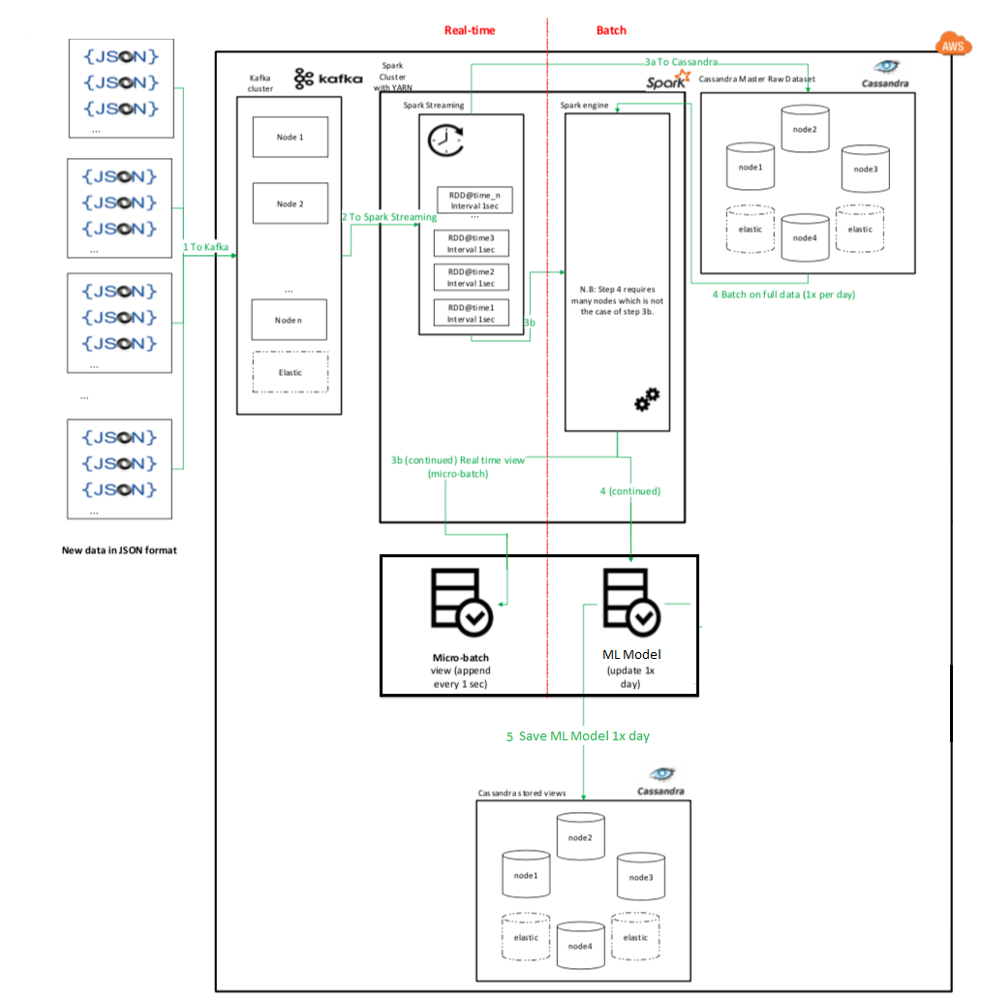

# Real time Credit Card fraud detection System

There is a continuous real time stream of credit/debit cards transactions. This system aims at analysing this transaction data as it comes in and identifying fraudulent transactions. Each transaction in the stream corresponds to a valid JSON record.

**Technologies used:** Kafka, Apache Spark and Spark Streaming, Cassandra

**Architecture diagram:**

**Description:**

1. There is a model that can identify fraudulent transactions. Each transaction is validated against the model in real time, then fraudulent transactions and non-fraudulent transactions are stored in two different tables in a Cassandra Key space. Immediate actions to stop fraudulent transactions can be taken based on new records added to database. An artificial real time stream was generated using a JSON file for testing purposes.

1. Model will be updated on a daily basis as a batch job. When creating a new model all the transactions occurred since creation of previous model along with other old data is taken into consideration.

1. There were CSV files containing customer data and transaction data collected before the implementation of this system. So that code was written to store that data in Cassandra database.

**Important Code files:**

1. TransactionProducer object: A Kafka Producer that generates a real time stream for testing purposes.
2. importToCassandra object:  Contains code to import data from CSV files into Cassandra.
3. trainFraudDetectionModel object: Contains code related to developing a model to predict a transaction fraudulent or not.
4. streamingApplication object: Contains code related to identifying fraudulent transactions real time.
